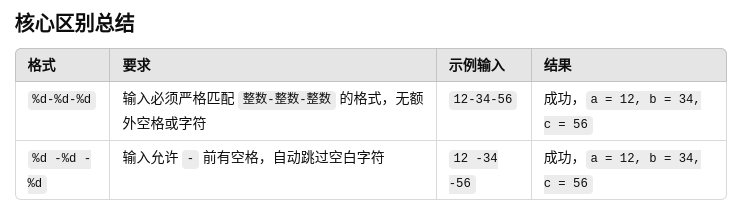

第一题
> xxxx86,1040 (x表示空格)
> 3.02530e+01
> 86.1620
> 1e-06
>

第二题
```c
    printf("%8.1e\n", x);
    printf("%-10.6e\n", x);
    printf("%8.3f\n", x);
    printf("%-6.0f\n", x);
```

第三题
`%d` 与 ` %d`的区别：无区别
`%d-%d-%d` 与 `%d -%d -%d`的区别：

第四题

i = 10
x = 0.3
j = 5

第五题
x = 12.3
i = 45
j = 0.6

