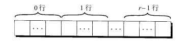
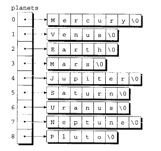

## C语言程序设计：现代方法

### chapter 3格式化输入/输出

> ### `gtchar()`的返回值为`int`而非`char`
>
> ```c
> char ch = getchar(); // 是合理的，只是发生了隐藏的类型转换而已
> int ch = getchar(); // 未发生强制类型转换
> ```
>
> 看一下getchar()的签名
>
> ```c
> int getchar( void )
> ```

### chapter 4 表达式

> [!Important]
>
> ["C operator Precedence"](https://en.cppreference.com/w/c/language/operator_precedence)

> [!Tip]
>
> C更多的强调表达式而非语句。

> [!Note]
>
> C/C++的`%`只和==左操作数==有关  [c99表明除法结果趋零截尾]
>
> 左右操作数只能是==整数==
>
> > %的本质是 $a \% b=a-(a/b)\times b$
>
> ```c
>     printf("1 %% 2 = %d\n", 1 % 2);
>     printf("-1 %% 2 = %d\n", -1 % 2);
>     printf("1 %% -2 = %d\n", 1 % -2);
>     printf("-1 %% -2 = %d\n", -1 % 2);
> 
> // output
> 1 % 2 = 1
> -1 % 2 = -1
> 1 % -2 = 1   //右操作数为负数，但结果为正
> -1 % -2 = -1 //左右操作数均为负数，结果应该是正数
> ```

**赋值语句的左操作数必须是==左值(lvalue)==**

> 左值（lvalue)
>
> 左值表示**对象[^1]**，而不是常量或者计算的结果。

> ### 前缀++与后缀++
>
> `prefix`: 先对变量进行自增，然后返回自增后的值
>
> `postfix`:先返回变量当前的值，然后对变量进行自增
> ==重点区别优先级顺序==

> [!Warning]
>
> `未定义行为 (undefined behavior)`
>
> 是指程序的代码没有明确的意义或行为，而标准也没有规定该代码的行为会产生什么结果。换句话说，当程序运行到未定义行为的代码时，**编译器不对结果负责**，程序可能会出现任何后果，包括但不限于崩溃、错误结果、甚至正常运行。


[^1]: C语言中对象(Object):region of data storage in the execution environment, the contents of which can represent values


### 选择语句 与 循环

> [!Note]
>
> `!` < 逻辑运算符 `&&`  `||`  < 关系运算符 < 算术运算符


> ### 悬空else ---- if-else 配对问题
>
> ```c 
> if (y != 0)
>     if ( x != 0)
>         result = x /y;
> else 
>     printf("Error: y is equal to 0\n");
> ```
>
> C标准规定`else`语句必须与离它最近且为匹配的`if`匹配,与形式缩进无关。

> #### C99布尔值
>
> ```c 
> _Bool flag;  //_Bool是(无符号)整数类型
> ```
>
> ```c
> #include <stdbool.h>  
> bool flag; //  same as _Bool flag;
> flag = false;
> flag = true;
> ```

> #####  `break` VS `continue`
>
> `break` 会直接跳出循环
>
> ```c
> while (1) {
>     //...
>     break;
> }
> // break 后直接到第5行
> ```
>
> `continue` 只是跳出本次循环
>
> ```c
> while(1) { // 跳转到循环入口
>     // ...
>     continue;
> }
> 
> ```

> ### goto 语句
>
> 在C99之前 goto可以跳转到任何地方，但C99后，goto语句不可以跳过`变长数组的声明`
>
> 即使这样 ==不推荐在任何代码里面使用goto==


### chapter 7 基本类型

> ##### 有符号数溢出 VS 无符号溢出
>
> 有符号整数运算中发生溢出时，程序的行为是`未定义的`
>
> 无符号整数运算中发生溢出时，结果是有定义的：`正确答案对2^n取模`

`size_t sizeof 运算符` 允许程序获取存储指定类型所需要的内存空间

 ```c
 typerdef unsigned size size_t;
 printf("Size of int: %zu\n", sizeof(int)); // 使用%zu显示sizeof
 ```

### chapter 8 数组

数组名本质是`指针`

比较常见的数组使用方式有

```c
for (i = 0; i < N; i++)
    	a[i] = 0;

for (i = 0; i < N; i++)
    	scanf("%d",&a[i]); // 注意如果使用a[i]则需要取地址 

```

> #### `[]` 🍬
>
> `[]`的本质是指针运算的语法糖🍬
>
> ```c
> a[i]   等价于  *(a + i)
> ```

> #### 指示器(C99)
>
> 一种特殊的初始化数组的方式
>
> ```c
> int a[15] = {[2] = 29, [9] = 7, [14] = 48};
> ```


> ##### 变长数组（C99)
>
> 通常情况下数组长度必须用`常量表达式`定义,但C99中，有时候也可以可以是常量表达式
>
> ```c
>  int n = 0;
>  scanf("%d", &n);
>  int a[n];
> 
>  for (int i = 0; i < n; i++) {
>      a[i] = i;
>      printf("%d ", a[i]);
>  }
> ```
>
> > [!note]
> >
> > 变长数组的长度在运行时候确定，但在数组的生命周期内仍然是固定长度的。
> >
> > 如果需要动态扩展数组长度需要`malloc`

> ##### C99 复合字面量
>
> ```c
> // 指向有5个元素的数组的第一个元素的指针
> int *p = (int [])(3, 0, 3, 4, 1); 
> ```
>
> **其生命周期限定在表达式的执行期间，使用完后会被销毁。**

### chapter 9 函数

> C语言 典型的`按值传递`

> ### 变长数组形式参数
>
> 下面的声明是合法的
>
> ```c
> int sum_array_1(int n, int a[n]); //  n用于指明变长数组的长度
> int sum_array_2(int n, int a[*]); // 可以用 * 代替数组长度
> int sum_array_3(int , int [*]); // 省去形参名字
> ```
>
> 但下面这种声明是==非法==的
>
> ```c
> int sum_array_worse(int a[n], int n); // error:
> ```
>
> 

> #### `static`使用于参数
>
> 用于庙宇数组a的长度至少保证是3
>
> ```c
> int sum_array_static(int a[static 3], int n) {
>     // ......
> }
> ```
>
> `对于多维数组，static仅可用于第一纬`

> #### 泛型选择`C1X`
>
> ```c
> _Generic( 表达式, 泛型关联列表)
> ```
>
> `sin 不同类型选择`
>
> ```c
> #define generic_sin(x) _Generic((x),\
>                         float: sinf,\
>                         double: sin,\
>                         long double: sinl,\
>                         float _Complex: csinf,\
>                         double _Complex: csin,\
>                         long double _Complex: csinl)(x)
> ```


###  chapter 10 程序结构

> ###### 可供参考的单文件结构
>
> - #include 指令;
> - #define 指令;
> - 类型定义;
> - 外部变量的声明;
> - 除main函数以外的函数原型;
> - main函数的定义
> - 其他函数的定义 // 采用盒型注释解释函数


> ## `exit(0)` vs `return 0`
>
> 对于`main`函数内的这两个函数效果一致，都是结束程序。
>
> 但位于其他位置的二者有区别
>
> `return 0` 如果是合法返回值会跳会调用者，如果非法，编译不通过。
>
> `exit(0)` 在任何位置都会直接结束程序

### 指针(11)、指针与数组、字符串、高级应用(12、17)

> ##### 关于指针最关键的点：确认类型

> ## 为啥要引入指针
>
> - C语言默认是按值传递参数，有时候修改修改参数就很不方便。
> - 把函数从非一等公民转换为函数指针，从而能和变量一样操作
> - 已经和内存的直接操作（动态内存管理、实现的复杂的数据结构....)
> - 用指针操作数组更高效

> ### 永远不要返回自动局部变量的指针
>
> ```c 
> int *f(void) {
>     int i; 
>     // ....
>     return &i;
> }
> ```
>
> 使用`static`可以使得代码合法，但不一定合理。
>
> ```c
> int *f(void) {
>     static int  i; 
>     // ....
>     return &i;
> }
> ```

指针与数组的关系，一句话:**数组的名字就是指向数组的第一个元素的指针**

> ##### 二维数组的名字
>
> `int a[3][3]`
>
> 类比一下一维数组，二维数组的名字是指向`a[0][0]`的`int *`类型的指针吗？
>
> <span style="color:red">错误</span>
>
> 要理解，C语言底层是没有啥二维数组（多纬），只有一维数组。
>
> 
>
> 所以`a->a[0]` 即二维数组的名字是一个指向数组的指针类型为`int (*)[3]` 

   

> #### C99中的指针和变长数组
>
> 指向一维变长数组的情况
>
> ```c
> void f(int n) {
>     int a[n], *p;
>     p = a;
>     // ....
> }
> ```
>
> 指向二维变长数组的情况
>
> ```c
> void f(int m, int n) {
>     int a[m][n], *(p)[n];
>     p = a;
> }
> ```
>
> 回顾一下指向二维数组名字的类型是啥？
>
> 此时p具有 **变量修改类型[^2]**

[^2]: 变量修改类型的声明必须出现在函数体内部或者函数原型中

**C风格字符串** C的字符串本质是`字符数组`且以`\0`结尾

> ## 字符串拼接(splicing)
>
> 传统上使用`\`来连接两个字符串，但由于该字面串必须从下一行的起始位置继续。会破环缩进风格
>
> ```c
> printf("When you come to a fork in the road, take it.
> --Yogi Berra");
> ```
>
> 现在一般采用如下规则`当两条或更多条字面串相邻时（仅用空白字符分割），编译器会把它们合并成一条字符串`
>
> ```c
> // 可以保存缩进风格
> printf("When you come to a fork in the road, take it. "
> 	        "--Yogi Berra");
> ```

> ### 注意，不可以通过指针修改字符串字面量

```c
char *p = "abc";

*p  = "d"; // 非法
```

原因参考课程Note，字面串存储与只读区域内。

> #### 风格：字符串定义
>
> ```c
> #define  STR_LEN 80 
> // ...
> char str[STR_LEN + 1];
> ```
>
> 定义长度的时候会声明字符串的元素个数，但在声明string的时候会把末尾的`\0`加上。
>
> ```c
> char date4[] = "June 14"; // 用初始化器定义的字符串长度可以省去，但以后不可以修改长度。
> ```

> ### 指向字符串的指针，与字符串名字的类型
>
> ```c
> char str[STR_LEN + 1];
> ```
>
> `str`的类型是啥？ ------- `char *`，字符串的本质是一维字符数组。根据数组与指针的关系可以知道，数组名为指向第一个元素(char)的指针,即`char *`
>
> 那么指向字符串的指针是啥类型呢?
>
> ```c
> (?)p =  &str;
> ```
>
> str的类型是`char *`是个指针，所以p是<span style="color:blue">指向指针的指针</span> ----> `char **`
>
> ```c
> char **p = &str;
> ```

> # <string.h>
>
> - strcpy函数 `char *strcpy(char *dest, const char *src)` <span style="color:red">字符串复制</span>
>   - 返回值`char *` 返回指向dest的指针
>   - `strncpy` [更安全的版本] `char *strncp( char *dest, const char *src, size_t count);`
> - [strlen](https://en.cppreference.com/w/c/string/byte/strlen)函数 `size_t strlen(const char *str)` <span style="color:red">字符串长度</span>
>   - 返回str第一个空字符之前的字符个数（不包括空字符）
> - [strcat](https://en.cppreference.com/w/c/string/byte/strcat)函数 `char *strcat(char *dest, const char *src)` <span style="color:red">字符串拼接</span>
>   - 把src的内容追加到dest的末尾，并返回指向dest的指针
> - [strcmp](https://en.cppreference.com/w/c/string/byte/strcmp)函数 `int strcmp(const char *lhs, const char* rhs)` <span style="color:red">字符串比较</span>
>   - 按字典序比较 [本质按ASCII码比较]
>     - 大写字母小于小写字母
>     - 数字全都小于字母
>     - 空白符号小于所有打印字符
>   - lhs > rhs ---> 大于0 , lhs == rhs ----> 0, lhs < rhs ----> 小于0

> #### 风格化建议
>
> - 搜索字符串结尾的空字符
>
> ```c
> // s 最终会指向空字符
> while (*s)
>     s++;
> 
> // s最终会指向空字符的下一个位置
> while (*s++)
>     ;
> ```
>
> - 字符串复制
>
> ```c
> while ((*p++ = *s2++) != 0)
>     ;
> ```
>
> - 字符串数组（不采用二维数组，而采用指针数组）
>
> ```c
> char *planets[] = {"Mercury", "Venus", "Earth",
>                           "Mars", "Jupiter", "Saturn",
>                           "Uranus", "Neptune", "Pluto"};
> ```
>
> 

> ##### 程序参数（命令行参数）
>
> C语言main有两个原型
>
> ```c
> int main(void); // 通常情况
> int main(int argc, char *argv[]);  // 接受命令行参数
> ```
>
> - argc : 参数个数
> - argv : 参数向量 
>   - 特别的argv[0] 指向 程序名
>   - argv[1]---argv[n-1]命令行参数

> # 内存分配函数 <stdlib.h>
>
> - malloc 函数 ---- 分配内存块，但是不会对内存块进行初始化
>
> 函数签名 `void *malloc(size_t size);`
>
> - calloc 函数 ----- 分配内存块，并且对内存块进行清零
>
> 函数签名 `void *calloc( size_t num, size_t size);`
>
> - realloc 函数 ----- 调整先前分配的内存块大小
>
> 函数签名 `void *realloc(void *ptr, size_t new_size);`

> ### 动态分配的内存一定要记得`free()`

> ## 悬空指针
>
> free()后会导致悬空指针，需要特别注意。
>
> ```c
> char *p = malloc(4 * sizeof char);
> char *pp = p;
> // ...
> free(p);
> // 此时p 和pp都成了悬空指针
> strcpy(p, "abc"); // 会导致为定义行为
> ```
>
> 常用解决办法
>
> - 使用前判断指针是否为NULL ---> 使用指针前尽量保证指针有效
>
> ```c
> char *p = malloc(4 * sizeof char);
> char *pp = p;
> // ...
> free(p);
> // 此时p 和pp都成了悬空指针
> if (p != NULL) strcpy(p, "abc";)
> ```

 

